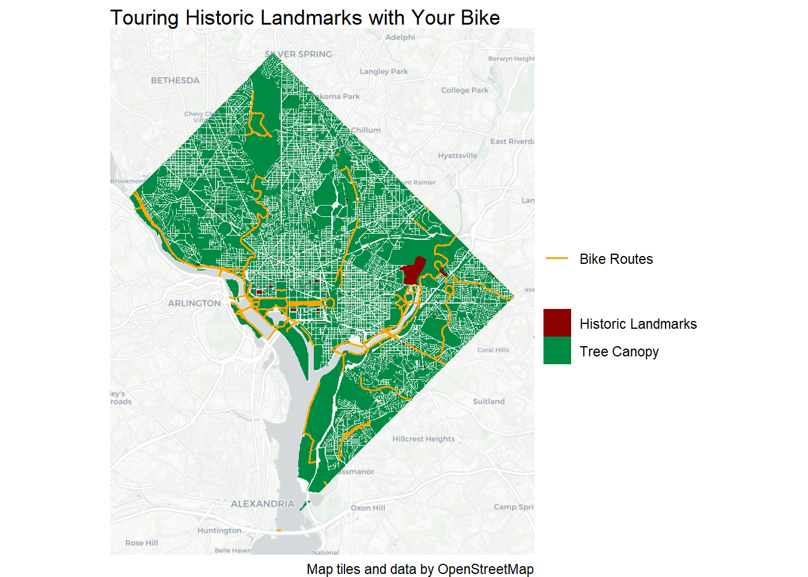
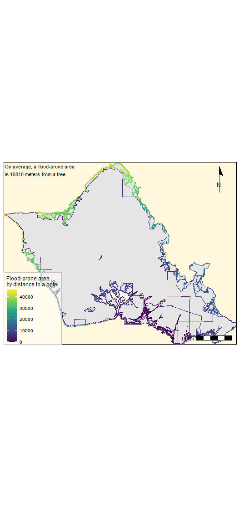
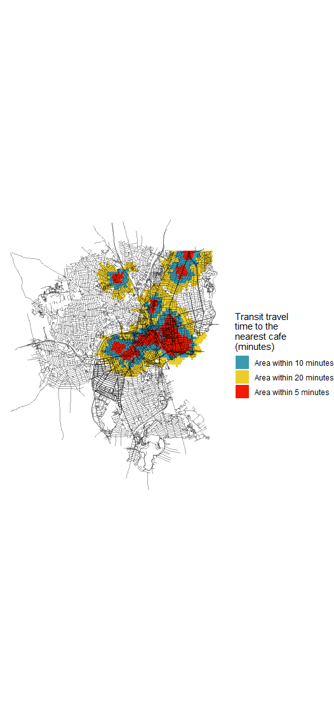

```{r setup, include=FALSE}
knitr::opts_chunk$set(echo = TRUE)
```

# Introduction

In the <VIS 2128: Spatial Analysis> course at the Harvard Graduate School of Design, I had great privilege to learn a plurality of geographical analysis tools. 

In this portfolio, I would like to assemble to demonstrate the skills in this class using RMarkdown and RStudio. I extensively the `downcute` theme, which is available as I installed the `rmdformats` package. The themes in the `rmdformats` have a table of contents that only includes level-one headings.

Other themes in the `rmdformats` package are `material`, `html_clean`, `html_docco`, `readthedown`, and `robobook`, but due to the scope of the project, level-one headings seem to suffice.  

In this portfolio, I would display each of the following skills:

* Displaying multiple vector layers on the same map
* Georeferencing a raster image
* Calculating and displaying relationships among point and polygon layers based on distance
* Calculating and displaying accessibility, based on travel time
* Displaying data on an interactive map

All in all, please refer to the table of contents below - for the details of my portfolio.


# Table of Contents

```
  I. Presentation of Multiple Vector Layers
  II. Concoction of an Old Map and Shape Files
  III. Display of relations among point and polygon layers
  IV. Introduction to Isochrones
  V. Interactive Map
```


## I. Presentation of Multiple Vector Layers

In Assignment 1, we explored map tiles and data by OpenStreetMap. Specifically, we created a pamphlet for the bike tourists at Washington DC. 

By juxtaposing the tree canopy and the bike routes as well as the historic landmarks in the capital of the United States, the end-user can capture great value in understanding the geography in the area.

This static map demonstrates the following skills: 
* Displaying a plural vector layers on a map

[](https://german-shepherd-dog.github.io/final-portfolio/fullsize/Assignment1.pdf){target="_blank"}


## II. Concoction of an Old Map and Shape Files

In Assignment 2, I visited Harvard Map Collective and located a century-old map of Honolulu, Hawaii. In this project, I scanned the big map of Oahu Island and georeferenced the map using ArcGis. 

The map clearly shows the tourism development that has been implemented over the past 100 years in Oahu Island. There used to be only two hotels back then, but currently there exist over 60 (Retrieved in Sep. 2021). Meanwhile, the coastal lines have not changed drammatically.

This map demonstrates the following skills:
* Georeferencing a raster map with points, lines, and polygons.

[](https://german-shepherd-dog.github.io/final-portfolio/fullsize/Assignment2.pdf){target="_blank"}


## III. Display of relations among point and polygon layers

In Assignment 3, I created a plot to depict if the resorts in Honolulu, HI are indeed located in safe areas. Specifically, I was curious that if the hotels are far from the flood-prone areas since Hawaii has been haunted by a plurality of Tsunami's for the past half a millenium. 

This map demonstrates the following skills:
* Displaying statistical analysis data using the distance between points and polygons.

[](https://german-shepherd-dog.github.io/final-portfolio/fullsize/Assignment3.pdf){target="_blank"}

## IV. Introduction to Isochrones

In Assignment 4-5, I crafted a plot to reflect a multitude of local coffee shops in Providence, Rhode Island area where I received my Master of Engineering degree. 

This map shows isochrones based on transit travel times to the nearest cafe. It demonstrates the following skills:

* Calculating and displaying accessibility, based on travel time

[](https://german-shepherd-dog.github.io/final-portfolio/fullsize/Assignment4.pdf){target="_blank"}


## V. Interactive Map

In Assignment 6, I drafted an interactive map that shows the population density in Honolulu, HI with the educational degree of Bachelor's or more. 
I also juxtaposed the public transit stops (bus stops) in order to check the correlation between resident's education level and their real estate preference toward public transporation accessibility.

This map demonstrates the following skills:
* Displaying an interactive map in a separate html file.

[](https://german-shepherd-dog.github.io/final-portfolio/fullsize/Assignment6.html){target="_blank"}